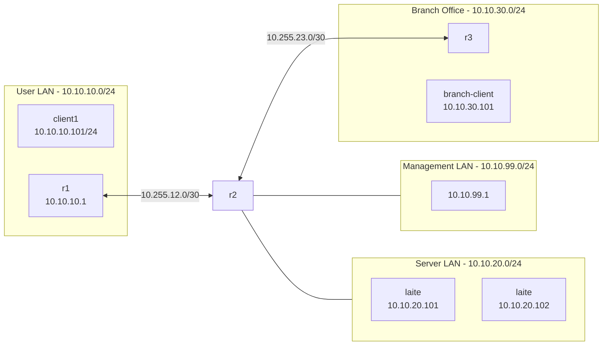
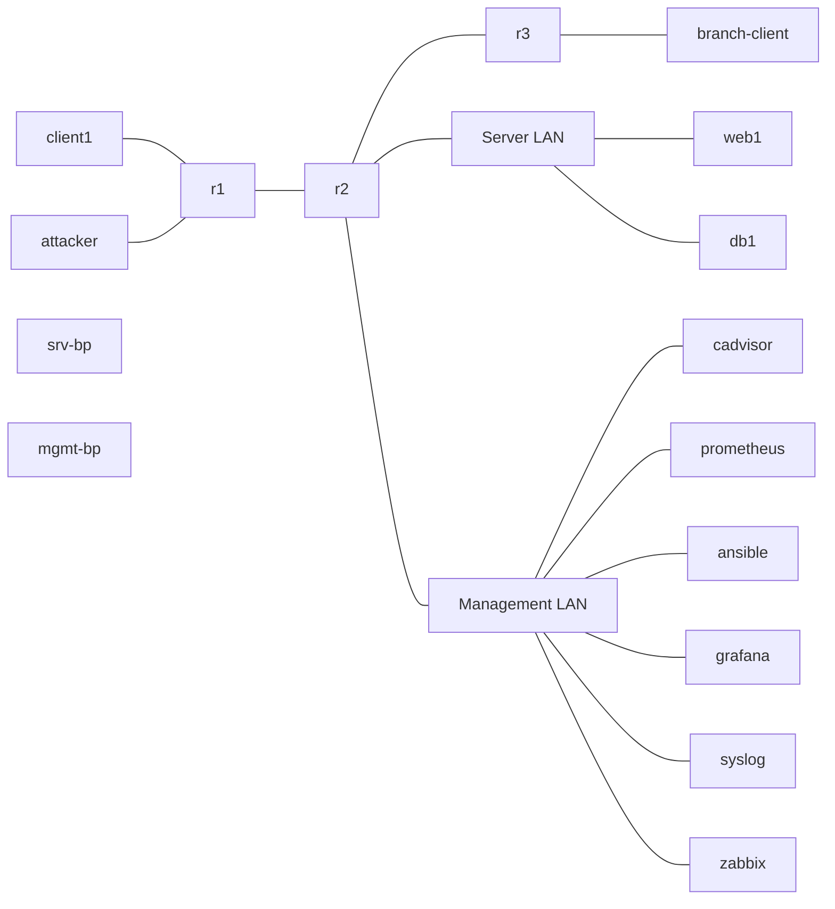

# Viikko 1 – Verkon dokumentointi (Ver 0.8)

## 1. Johdanto

Tässä harjoituksessa tutustuttiin Containerlabilla ja Docker-konteilla toteutettuun virtuaaliseen verkkoympäristöön. Ympäristö oli kopioitu annetusta Github-reposta jonka pystytin Windows 11 - koneelle WSL2.0 - avulla.

Tehtävässä jouduin käyttämään useita, itselleni uusia komentoja joiden avulla selvitin verkkoa käyttäviä laitteita. Lähtökohtana yritin käyttää ajatusta että selvitän verkkoa pelkästään yhdestä kontista ilman pääsyä muihin kontteihin. Tässä tapauksessa valitsin ohjeissa annetun client1.

Johtuen tehtävänannosta, tein vielä toiset versiot kaikista containerlabin topologian avulla.

---

## 2. Verkkokaavio

Verkon rakennetta tutkin reposta löytyvän verkkotyökalu-oppaassa (topology.md) kerrottujen komentojen antamien tulosteiden perusteella.



Verkon topologia kuvattuna Containerlabin topologiasta.



---

## 3. Laiteluettelo

Laiteluettelo scannailun perusteella

| IP-osoite | Laite | Avoimet portit | Tarkoitus |
|---|---|---|---|
| 10.10.10.1 | r1 | 2601,2604 |  |
| 10.10.10.101 | client1 | 22, 9100 | Käytettävä kontti |
| 10.10.10.254 | r1 | 2601,2604 | Sama MAC-osoite |
| 10.10.20.1 | r2 | 2601,2604 | Reititin |
| 10.10.20.101 | web1/db1 | 22,9100 | Jompi kumpi |
| 10.10.20.102 | web1/db1 | 22,9100 | Jompi kumpi |
| 10.10.30.1 | r3 | 2601,2604 | Reititin |
| 10.10.30.101 | Branch Officen kontti |
| 10.10.99.1 |   | 2601,2604 |   |
| 10.255.12.1 | r1 | 2601,2604 | Yhdistelemällä useita tuloksia näyttäisi olevan r1-r2 välinen verkko |
| 10.255.12.2 | r2 | 2601,2604 | Yhdistelemällä useita tuloksia näyttäisi olevan r1-r2 välinen verkko |
| 10.255.23.1 | r2 | 2601,2604 | Yhdistelemällä useita tuloksia näyttäisi olevan r2-r3 välinen verkko |
| 10.255.23.2 | r3 | 2601,2604 | Yhdistelemällä useita tuloksia näyttäisi olevan r2-r3 välinen verkko |

Laiteluettelo containerlabin topologian avulla

| Laite | Tarkoitus |
|---|---|
| r1 | User LAN -verkon reititin |
| r2 | Yhdistää r1, r3 ja pari kytkintä joiden perässä on valvonta- ja serverikontit |
| r3 | Branch Office -verkon reititin |
| client1 | User LAN -verkon asiakaskontti |
| attacker | Attacker, käytetään ilmeisesti jossain vaiheessa kun ei näy arp-taulukossa ja näyttäisi olevan portit kiinni |
| web1 | Web-palvelin |
| db1 | Tietokantapalvelin |
| branch-client | Branch Officen kontti |
| ansible | Automaation hallintakontti |
| prometheus | Mittaus- ja monitorointitiedon keräämiseen tarkoitettu kontti |
| grafana | Prometheuksen datan graaffiseen näyttöön tarkoitettu kontti |
| zabbix | Verkon ja palveluiden valvontaan tarkoitettu kontti |

### Client1

Client1 on User LAN -verkossa sijaitseva kontti. Kontilla on kaksi verkkoa:

| Liitäntä | IP-osoite | Verkko |
|---|---|---|
| eth0 | 172.20.20.5/24 | Containerlab/Docker-hallintaverkko |
| eth1 | 10.10.10.101/24 | User LAN |

Client1:n oletusyhdyskäytävä on `10.10.10.1` joten muihin harjoitusympäristön verkkoihin suuntautuva liikenne kulkee eth1-liitännän kautta.

---

## 4. IP-suunnitelma

Ympäristössä havaittiin seuraavat verkot:

| Verkko | Tarkoitus | Yhdyskäytävä |
|---|---|---|
| 10.10.10.0/24 | User LAN | 10.10.10.1 |
| 10.10.20.0/24 | Server LAN | 10.10.20.1 |
| 10.10.30.0/24 | Branch Office | 10.10.30.1 |
| 10.10.99.0/24 | Management LAN | 10.10.99.1 |
| 10.255.12.0/30 | r1-r2 välinen yhteys | - |
| 10.255.23.0/30 | r2-r3 välinen yhteys | - |

### Havaitut IP-osoitteet

#### User LAN – 10.10.10.0/24

| IP-osoite | Laite / havainto |
|---|---|
| 10.10.10.1 | Oletusyhdyskäytävä / r1 |
| 10.10.10.101 | client1 |
| 10.10.10.254 | Vastasi pingiin, sama MAC-osoite kuin 10.10.10.1 (hallinta-osoite?) |

#### Server LAN – 10.10.20.0/24

| IP-osoite | Laite / havainto |
|---|---|
| 10.10.20.1 | Yhdyskäytävä |
| 10.10.20.101 | laite |
| 10.10.20.102 | laite |

#### Branch Office – 10.10.30.0/24

| IP-osoite | Laite / havainto |
|---|---|
| 10.10.30.1 | Yhdyskäytävä |
| 10.10.30.101 | branch-client |

#### Management LAN – 10.10.99.0/24

| IP-osoite | Laite / havainto |
|---|---|
| 10.10.99.1 | Yhdyskäytävä |

#### Reitittimien välinen verkko – 10.255.12.0/30

| IP-osoite | Laite / havainto |
|---|---|
| 10.255.12.1 | Reitittimen liitäntä |
| 10.255.12.2 | Reitittimen liitäntä |

#### Reitittimien välinen verkko – 10.255.23.0/30

| IP-osoite | Laite / havainto |
|---|---|
| 10.255.23.1 | Reitittimen liitäntä |
| 10.255.23.2 | Reitittimen liitäntä |

### Containerlabin hallintaverkko

Varsinaisen harjoitusverkon lisäksi konteilla on erillinen `172.20.20.0/24`-verkko. Esimerkiksi client1 käyttää siinä osoitetta `172.20.20.5/24`.

Tämä verkko on erotettu varsinaisista 10.x.x.x-harjoitusverkoista ja sitä käytetään Containerlab/Docker-ympäristön konttien hallintaan.

| IP-osoite | Avoimet portit | Havainnot |
|---|---|---|
| 172.20.20.1 | 3000,8000,8080,9090 | Tämä viittaa googlen mukaan kontti-hostiin huomioiden ympäristön |
| 172.20.20.2 | 22 |   |
| 172.20.20.3 | 22 |   |
| 172.20.20.4 | 8080 |   |
| 172.20.20.5 | 22,9100 | Käytettävä kontti |
| 172.20.20.6 | 22,9100 |   |
| 172.20.20.7 | 2601,2604 | Viittaa FFRouttingiin |
| 172.20.20.8 | 3000 | Portti 3000 viittaa grafanaan |
| 172.20.20.9 | 22, 9100 |   |
| 172.20.20.10 |   | Kaikki portit kiinni |
| 172.20.20.11 | 2601,2604 | Viittaa FFRouttingiin |
| 172.20.20.12 | 80 |   |
| 172.20.20.13 |   | Kaikki portit kiinni |
| 172.20.20.14 | 9090 |   |
| 172.20.20.15 | 2601,2604 | Viittaa FFRouttingiin |
| 172.20.20.16 | 22 |   |
| 172.20.20.17 | 8080 |   |
| 172.20.20.50 | 514 | Viittaa Sysloggiin |

---

## 5. Reitityksen analyysi

### Client1:n verkkoliitännät

Client1:n verkkoliitännät tutkittiin komennolla:

```bash
ip a
```

Tulosteesta havaittiin kaksi verkkoliitäntää:

```text
eth0: 172.20.20.5/24
eth1: 10.10.10.101/24
```

### Client1:n reititystaulu

Reititystaulu tarkistettiin komennolla:

```bash
ip route
```

Tuloste:

```text
default via 10.10.10.1 dev eth1
10.10.10.0/24 dev eth1 proto kernel scope link src 10.10.10.101
172.20.20.0/24 dev eth0 proto kernel scope link src 172.20.20.5
```

Reititystaulun perusteella client1:n oletusyhdyskäytävä on `10.10.10.1`. User LAN on suoraan saavutettavissa eth1-liitännän kautta ja Containerlabin hallintaverkko eth0-liitännän kautta.

### Yhteys Server LAN -verkkoon

Yhteyttä Server LAN -verkossa olevaan osoitteeseen `10.10.20.101` testattiin komennolla:

```bash
ping -c 4 10.10.20.101
```

**Tuloste:**

```text
root@client1:/# ping -c 4 10.10.20.101
PING 10.10.20.101 (10.10.20.101) 56(84) bytes of data.
64 bytes from 10.10.20.101: icmp_seq=1 ttl=62 time=0.086 ms
64 bytes from 10.10.20.101: icmp_seq=2 ttl=62 time=0.074 ms
64 bytes from 10.10.20.101: icmp_seq=3 ttl=62 time=0.072 ms
64 bytes from 10.10.20.101: icmp_seq=4 ttl=62 time=0.070 ms

--- 10.10.20.101 ping statistics ---
4 packets transmitted, 4 received, 0% packet loss, time 3131ms
rtt min/avg/max/mdev = 0.070/0.075/0.086/0.006 ms
```

Tracerouten perusteella liikenne kulkee seuraavaa reittiä:

```text
client1 (10.10.10.101)
        ↓
10.10.10.1
        ↓
10.255.12.2
        ↓
10.10.20.101
```

### Yhteys Branch Office -verkkoon

Yhteyttä branch-clientiin testattiin komennolla:

```bash
ping -c 4 10.10.30.101
```

**Tuloste:**

```text
root@client1:/# ping -c 4 10.10.30.101
PING 10.10.30.101 (10.10.30.101) 56(84) bytes of data.
64 bytes from 10.10.30.101: icmp_seq=1 ttl=61 time=0.089 ms
64 bytes from 10.10.30.101: icmp_seq=2 ttl=61 time=0.071 ms
64 bytes from 10.10.30.101: icmp_seq=3 ttl=61 time=0.068 ms
64 bytes from 10.10.30.101: icmp_seq=4 ttl=61 time=0.071 ms

--- 10.10.30.101 ping statistics ---
4 packets transmitted, 4 received, 0% packet loss, time 3043ms
rtt min/avg/max/mdev = 0.068/0.074/0.089/0.008 ms
```

Reitti tutkittiin komennolla:

```bash
traceroute 10.10.30.101
```

Havaittu reitti:

```text
client1 (10.10.10.101)
        ↓
10.10.10.1
        ↓
10.255.12.2
        ↓
10.255.23.2
        ↓
branch-client (10.10.30.101)
```

Tuloksen perusteella liikenne kulkee User LAN -verkosta usean reitittimen kautta Branch Office -verkkoon.

### Verkkojen kartoitus Nmapilla

Verkkojen aktiivisia laitteita kartoitettiin esimerkiksi komennoilla:

```bash
nmap --traceroute -sn 10.10.20.0/24
```

Vastaavalla tavalla tutkittiin verkot:

```text
10.10.10.0/24
10.10.20.0/24
10.10.30.0/24
10.10.99.0/24
10.255.12.0/30
10.255.23.0/30
```

Nmapin avulla pystyttiin selvittämään aktiivisia IP-osoitteita sekä tarkastelemaan liikenteen kulkemaa reittiä eri verkkoihin sekä avonaisia portteja yksittäisistä IP-osoitteista.

---

## 6. Yhteenveto

Harjoituksessa kartoitettiin Containerlabilla toteutetun virtuaalisen verkon rakennetta. Verkon tutkimisessa käytettiin Linuxin verkkotyökaluja, joiden avulla selvitettiin laitteiden IP-osoitteita, verkkojen välisiä yhteyksiä sekä liikenteen käyttämiä reittejä.

Tässä käytin jo tehtävänannoissa käytettyjä nimiä ja verkkoja apuna topologian teossa.

### Mikä vei eniten aikaa?

Suurin osa ajasta meni siihen että sain ympäristön toimimaan, linkitettyä Githubiin ja tutustuessa Mermaidiin (valitsin Mermaidin sen takia että tämä koko kurssin palautukset on tarkoitus tehdä Githubiin ja Mermaidin integraatio Githubin kanssa on varsin saumaton). Linkitin sitten myös VS coden WSL:ään joten saan kirjoitettua palautukset VS codella ja pushattua ne WSL:stä suoraan Githubiin. Mermaid ei ollut tämän tehtävänannon listalla suoraan mutta siitä oli maininta jossain toisessa dokumentaatiossa (joita oli liian paljon ja liian monessa paikassa että niiden seuraaminen ja päättäminen että mitä uskoo oli ongelma).

Tehtävässä käytin Chatgpt:tä apuna pitämään yllä osoite-listaa. Annoin kehoitteeksi "Älä vastaa nyt seuraaviin, kirjoitan vain itselle muistiin tähän ip-osoitteita/laitteita mitä löydän" jonka jälkeen pastesin käytettävien komentojen esim. nmap --traceroute -sn 10.10.10.0/24 tulosteita sille. Lopuksi käytin kehoitetta "Tee selvästi luettava taulukko ip-osoitteista pastetuista kehoitteista". Lopuksi, kunhan sain tehtyä omasta mielestäni selkeän reititys-taulukon/topologian niin pastesin sen chatgpt:lle ja annoin kehoitteen "Tee annetusta topologiasta Mermaidille tehty koodi käytettäväksi Githubissa".

Containerlabin topologian avulla tehdyn kuvassa en käyttänyt enään Chatgpt:n apua.

Tehtävänannossa oli tehtävään arvioitu käytettävä aika 4-8h joka vähintään tuplaantui minun tapauksessa. 

### Miten dokumentaatio auttaa IT-asiantuntijaa?

Ajantasainen dokumentaatio helpottaa verkon ylläpitoa ja vianetsintää. Tämä olisi ehdottoman tärkeää aloittaa heti verkkoa suunnitellessa tekemään jolloin kaikki, esimerkiksi laitteiden vaihdot, lisäykset tai poistot olisi huomattavasti helpompia ja kokonaisuuden hallinta pysyy helpommin käsissä jos verkko lähtee laajentumaan.