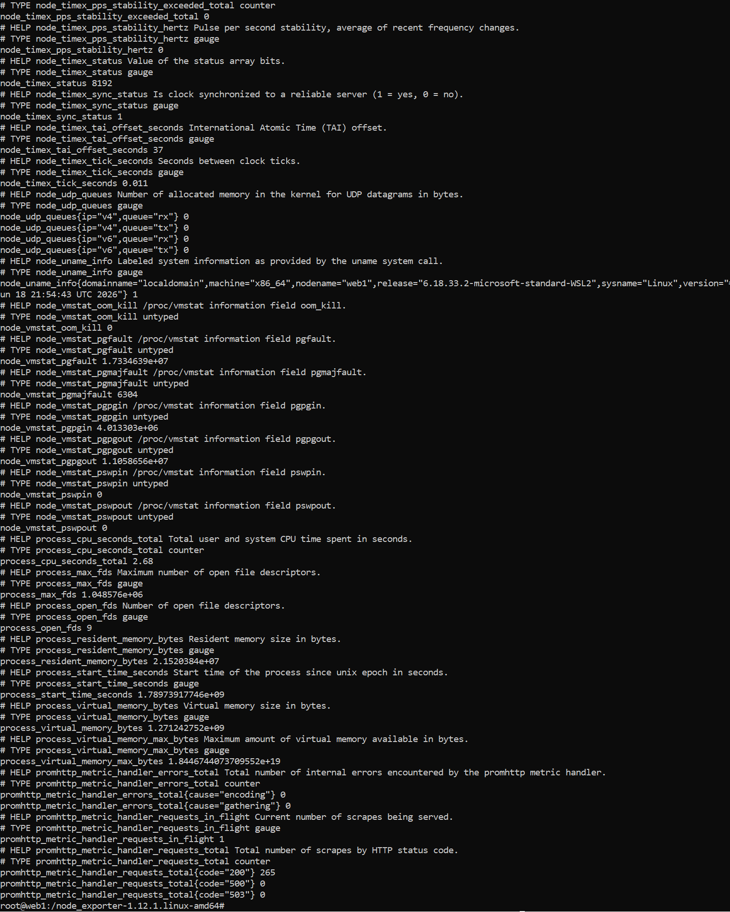
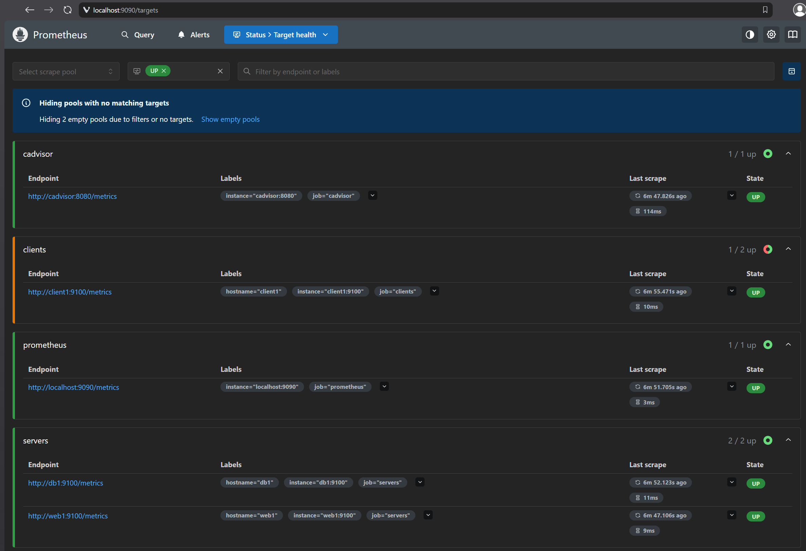
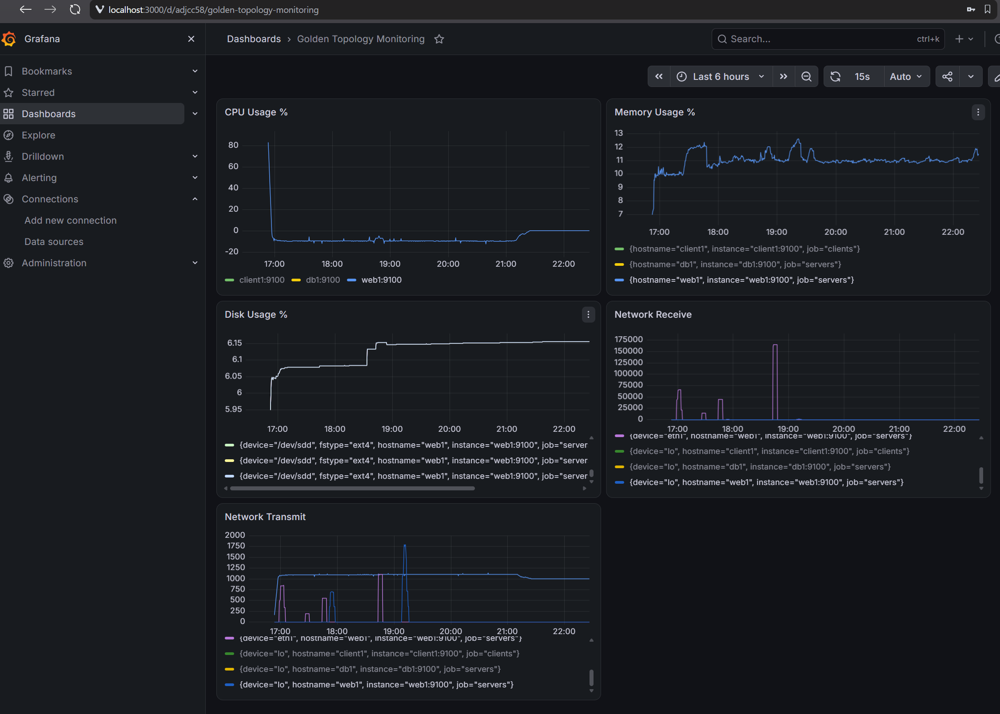
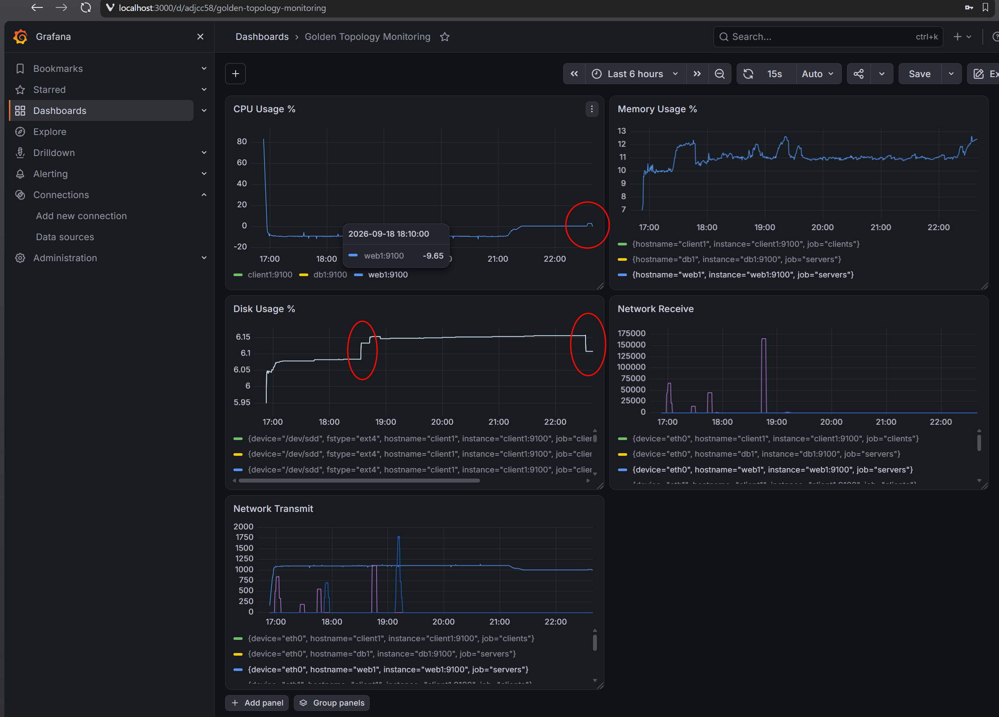

# Viikko 3 – Monitorointi Prometheuksella ja Grafanalla (ver 1.01)

## 1. Johdanto

Verkonhallinnassa monitoroinnilla tarkoitetaan järjestelmän eri osien ja niiden toimintaa kuvaavien yksittäisten mittareiden jatkuvaa seurantaa. Kyseessä voi olla yksittäisen suorittimen rasituksen seurannasta yksinkertaiseen järjestelmän ylhäällä olo-tietoon.
Eri mittareiden monitorointi on tärkeää erityisesti koko tietoverkon ylläpidon ja kehityksen kannalta. Kun on jatkuvaa tietoa millä tasolla eri yksiköt/laitteet/mittarit toimii niin voidaan keskittyä kehittämään niitä järjestelmän osia jotka ovat lähellä kriittistä toimintapistettä tai ongelmatilanteissa voidaan jo nähdä paikat joissa se ongelma on. Myös mitattaviin kohteisiin voidaan lisätä hälytyksiä jolloin päästään puuttumaan ongelmiin ennen kuin ne näkyvät käyttäjille.

Tällä viikolla tulivat tutuiksi Node exporter, Prometheus, PromQL ja Grafana.

### Node exporter

Node exporter on avoimen lähdekoodin työkalu. Node exporter lukee ja muuttaa datan, esimerkiksi suorittimen/levytilan/verkkoliitäntöjen tietoja metriikka-muotoon ja laittaa sen jakoon josta scraperi voi käydä noutamassa sen datan.

### Prometheus

Prometheus on avoimen lähdekoodin järjestelmä, joka kerää ja tallentaa valvottavista kohteista dataa aikasarjana. Prometheus käyttää ns. scraping-toimintamallia, eli kuvavaasti kaavitaan dataa kohteiden exportereista yleensä HTTP-rajapinnan kautta.

### PromQL

PromQL on Prometheuksen sisäänrakennettu kyselykieli jolla voidaan käsitellä Prometheuksen tallentamaa dataa ja muodostaa siitä tarvittavia suureita halutussa muodossa. Sillä voidaan esimerkiksi hakea jonkun yksittäisen suureen tietoa tai käsitellä sitä jollain tavalla, esimerkiksi summata/jakaa/muuttaa tarvittavaksi.

### Grafana

Grafana on avoimen lähdekoodin datan visualisointiin tarkoitettu ohjelma. Sillä muutetaan ns. raakadata graaffiseen muotoon kuvaajaksi käyttäen muokattavaa kojelautaa johon voidaan koota haluttuja mittareita. Mittareita voidaan käyttää näyttämään esimerkiksi CPU-kuormitusta, muistinkäyttö-astetta tai verkkoliikennettä ja niihin voidaan lisätä hälytykset jos esimerkiksi CPU-kuormitus nousee liian korkeaksi. Myös tilatietoja voidaan liittää siihen ja saada esimerkiksi palvelimen kaatumisesta hälytykset.

## 2. Ympäristön rakentaminen ja Node Exporterin käyttöönotto

### 2.1 Ympäristö

Kokonaisuus rakennetaan jo aiemmin ylös ajettuun kontti-ympäristöön käyttäen aikaisempien viikkojen raportteja kun kontti-ympäristön tallennus ei toimi.

Valvottavaksi kohteeksi valittiin web1-kontti jossa ajettiin erilaisia testejä, joita sitten tulkittiin Grafanan piirtämistä kuvaajista. Asennuksessa huomasin että myös db1 ja client1 tulivat myös osaksi valvontaa.

### 2.2 Node Exporterin asennus

Jotta Node exporter saadaan asennettua, ensin asennetaan wget seuraavalla komennolla

```bash
apt update && apt install wget tar -y
```

Node exportterista haluamme asentaa uusimman version joten käydään seuraavassa osoitteessa tarkistamassa uusin verio

[Node exporter releases](https://github.com/prometheus/node_exporter/releases/)

Jonka jälkeen voidaan ladata seuraavalla komennolla uusin verio-paketti (muuta oikea versio komentoon)

```bash
wget https://github.com/prometheus/node_exporter/releases/latest/download/node_exporter-<version>.linux-amd64.tar.gz
```

Seuraavaksi ladattu paketti puretaan komennolla

```bash
tar xvf node_exporter-*.linux-amd64.tar.gz
```

Siirrytään puretun paketin hakemistoon (tarkista versio-numero)

```bash
cd node_exporter-1.12.1.linux-amd64
```

Käynnistetään Node exportter

```bash
./node_exporter
```

Seuraavalla komennolla voidaan tarkistaa, onko kyseisestä exportterista saatavilla tietoja

```bash
curl http://localhost:9100/metrics
```

Jos vastaukseksi saadaan todella pitkä lista jossa on esimerkiksi seuraavanlaista tietoa



niin Node exportteri on toiminnassa

## 3. Prometheus

Prometheus voidaan avata kontti-ympäristöä ajavalla koneella menemällä selaimella osoitteeseen

```dash
http://localhost:9090/
```

Sen pitäisi avata vastaavanlainen näkymä kuin alla. Valitaan ylhäältä Status -> Target health ja sen jälkeen voidaan suodattaa tulokset valitsemalla UP



Kuten tästä nähdään, kohde web1 on ylhäällä ja siitä saadaan kaavittua tietoja.

## 4. Grafana

### 4.1 Kojelauta

Grafanaan lisättiin opettajan antamat PromQL - elementit. Niillä voi seurata suorittimen, levytilan ja muistin käyttöastetta sekä verkkoliitäntöjen liikennettä.




## 5. Kuormitustesti ja havainnot

### 5.1 Kuormitustestin toteutus

Kuormitustestissä kokeiltiin kahdenlaista erilaista tapaa. Toinen kuormittaa suorittimia ja toinen levytilaa.

Prosessorin kuormitus toteutettiin asentamalla stress-ng alla olevalla käskyllä

```bash
apt install stress-ng
```

jonka jälkeen sillä rasitettiin neljää suoritinta 60s ajan käskyllä

```bash
stress-ng --cpu 4 --timeout 60
```

Levytilaa testattiin kirjoittamalla 500Mt kokoinen tiedosto nollia täyteen seuraavanlaisella komennolla

```bash
dd if=/dev/zero of=testfile.img bs=1M count=500
```

Alla on kuvakaappaus mittareista joissa näkyy miten prosessorin 5m keskiarvo on noussut sen aikana sekä 500Mt tiedoston kirjoituksen ja poiston vaikutus vapaaseen levytilaan.



### 5.3 Havainnot monitoroinnista

Suorittimen käyttöasteessa huomasin heti alkuun ongelmia. Eli se alkuun näytti tasasista n. -9% joka ei tietenkään voi olla mahdollista. Tarkistin kaavat, ajoin konteissa erilaisia testejä joilla mittasin suorittimen tuottamia arvoja ajan suhteen että löytäisin poikkeavuuksia mutta kaikki testit näytti menevän hyvin ja poikkeavuuksia ei löytynyt. Prometheuksesta kun ajoin testejä niin kaikki näytti oikein mutta käytännössä samoja arvoja ja melkein samoja suoritteita käyttäen Grafana halusi näyttää -9%. Tämä jäi mysteeriksi koska aikaa alkoi kulumaan liikaa.

Itse kuormitustestit näkyi selvästi suorittimen 5m keskiarvon nousuna. Kuten myös imagen kirjoitus ja poisto näkyi selvästi levyä seuraavassa mittarissa.

## 6. SNMP vs. Prometheus

| Ominaisuus | SNMP | Prometheus |
| Tiedonkeruu | SNMP kyselee agentilta tietoja | Prometheus hakee (kaapii) tiedot rajapinnasta |
| Käyttöönotto | Suht helppo peruskäyttöönotto | Suht helppo peruskäyttöönotto |
| Mittarien määrä | Riippuu paljon laitteesta mitä se tukee | Kaappaa kaiken pitä exportteri sille eteen tuo |
| Visualisointi | SNMP ei tuota visualisointia | Prometheuksessa saa PromQL kyselyn graaffisena |
| Hälytysmahdollisuudet | Saa trappeja mutta vaatii lisäosia | Saa helpommin määritettyjä rajoja ja ilmoituksia (Alertmanager) |
| Soveltuvuus pilviympäristöihin | Huono | Erinomainen |

Vähän epäreilu vertailu kun minusta molemmat on tarkoitettu eri tarkoituksiin. Molemmat vaatii toimiakseen muutakin kuin pelkän SNMPn tai Prometheuksen. SNMP on pelkkä protokolla, jota edelleen tuetaan ja jolla on oma paikkansa joka minusta on enemmän perinteisten verkkojen ja jopa uusien verkkolaitteiden valvonnassa kun taas Prometheus on iso ekosysteemi joka pitää sisällään jo tietokannan, PromQL kyselykielen, hälytysjärjestelmän jne. yhdessä paketissa joka toimii erinomaisesti (ja ilmeisesti suunniteltukin) pilvi- ja konttiympäristössä, mutta vaatii kuitenkin exportterit ja tässäkin käytetyn Grafanan. Tästä lukiessani yleensä kaikki oli niputettu yhdeksi ja samaksi.

## 7. Yhteenveto ja pohdinta

Kerroinkin edellisessä kohdassa jo niiden eroista ja miksi niitä ei minusta pitäisi verrata keskenään joten en tässä pureudu siihen vaan käsittelen enemmän Prometheusta.

Käytän itse työssäni paljon trendidatan seurantaa niin osaan arvostaa jatkuvaa datan seurantaa. Kun oppii seuraamaan omaa järjestelmää niin niistä näkee heti poikkeukset ja jopa syyt miksi jotain tapahtuu. Yleensä aloitan päivän katsomalla tärkeimmät trendit omalta laitokselta jolloin näen jo heti jos joku vaatii huomiota.

PromQL kyselykielestä tuli mieleeni heti SQL kyselykieli koska niiden syötteet oli hyvinkin samankaltaisia. Tietenkin täysin erilaisia koska toinen käsittelee aikajanaa ja toinen relaatiotietokantaan. Niiden käsittely tuntui yllättävänkin luontevalta.
Sinänsä Prometheus+Grafana yhdistelmä tarjoaa hyvän pohjan seurata vain niitä mittareita jotka ovat tärkeitä kohteen luonteesta riippuen. Tarvitaanko joltain tiedostopalvelimelta suorittimen käyttöastetta seurantaan vai keskitytäänkö sen verkkoliikenteen ja levyn seurantaan? Liian paljon mittareitakin saattaa aiheuttaa niiden tärkeimpien mittareiden piiloon menemisen niin kuten edellisellä viikolla SNMP:stä sanoin, pätee myös tässäkin että kohteesta tarvitaan ne tiedot jotka on tärkeimpiä. 
Jos tarvitaan selvitellä jotain niin se on helppo tarkistaa PromQL:llä tai tehdä siitä mittari koska Prometheus on pitänyt tietokannan kuitenkin tiedoista.

Jos pitäisi joku esimerkki sanoa että miten se auttaa vianetsinnässä niin esimerkiksi voidaan katsoa verkkoliitäntöjen käyttöastetta ja huomata että jos jonku kontin läpi pitäisi mennä liikennettä ja huomataan että yhden verkkoliitännän liikenne pysähtyy niin voidaan heti kohdentaa vianetsintä sinne.


